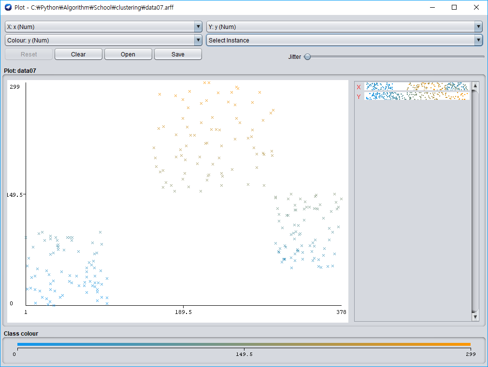
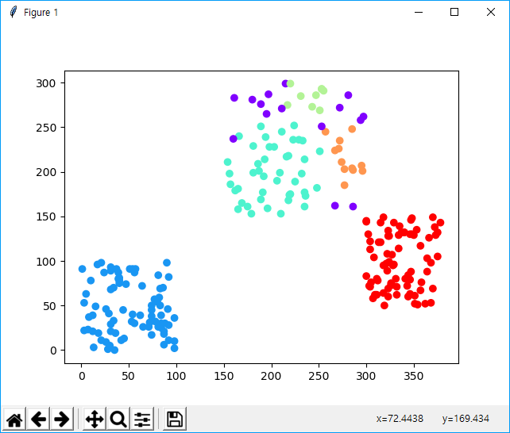
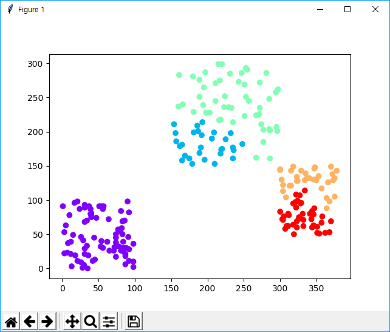
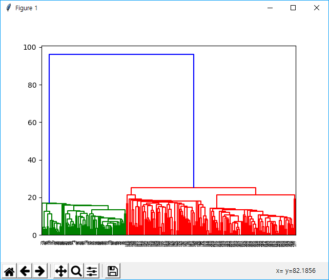

# clustering

Implementation with python scikit-learn & java weka library.

## Python Dependency

- numpy
- sklearn
- matplotlib

## Java Dependency

- weka

# Test with python

## Dataset

- Use [data07.txt](./test/data07.txt)
- Visualized data07.txt (Using weka GUI(data07.arff))

 
 

## Result

### 1. K-means Clustering

 

### 2. Agglomerative Hierachical Clustering

- **Matplotlib Graph**

 

- **Dendrogram**

 

### 3. DBSCAN

